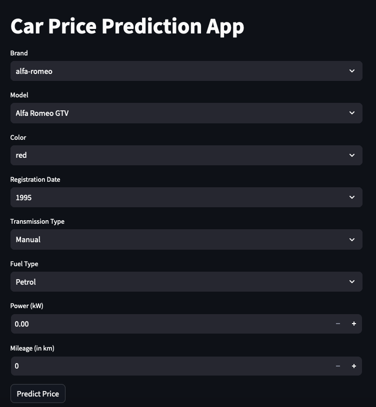
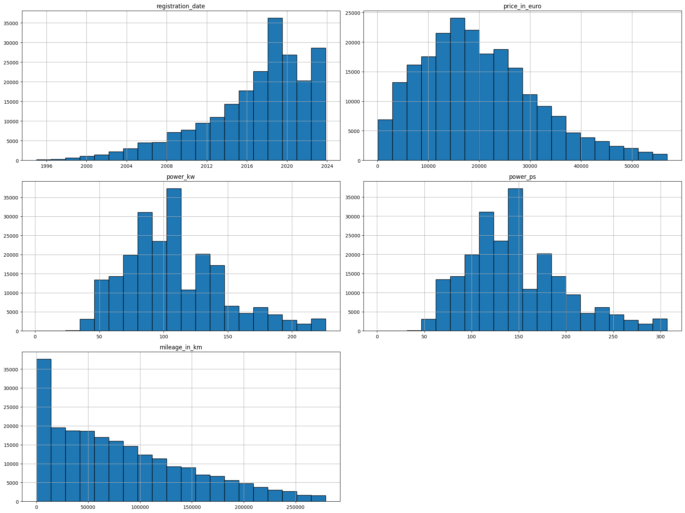
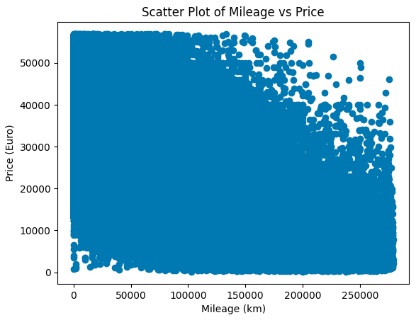
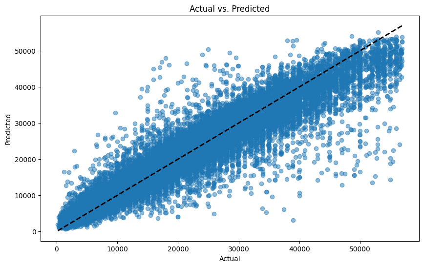
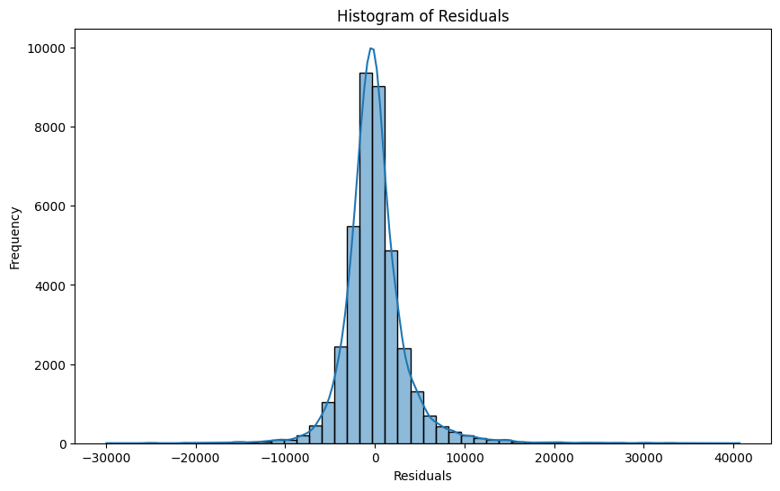
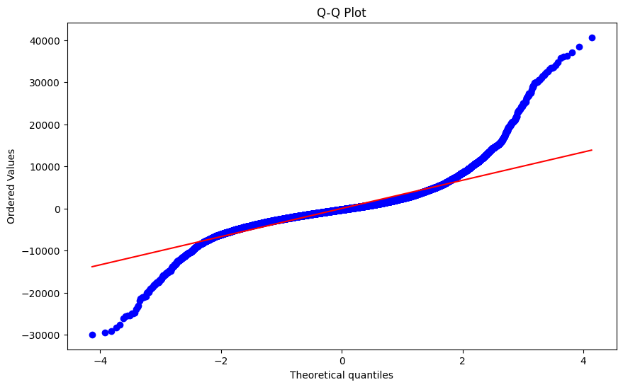
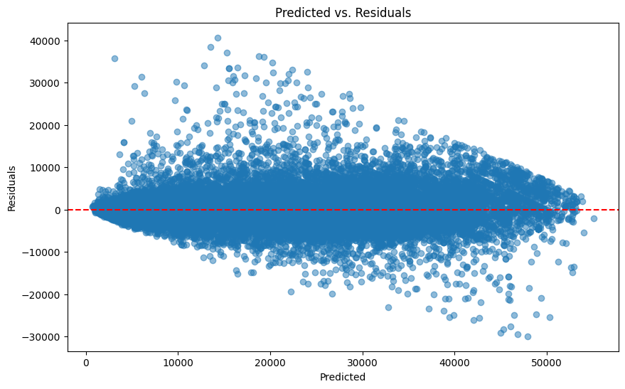
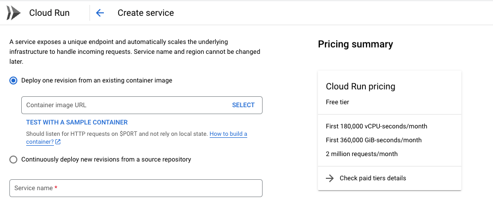

## Midterm project for Machine Learning Zoomcamp

Hello everyone, this is my midterm project for the 2023 cohort of the course [Machine Learning Zoomcamp](https://github.com/DataTalksClub/machine-learning-zoomcamp). This project will aim to train a machine learning model to predict prices of cars sold in Germany.

The dataset can be downloaded [here](https://www.kaggle.com/datasets/wspirat/germany-used-cars-dataset-2023).

The final app can be tried here: https://streamlist-car-prices-jvgkqtvdxq-ey.a.run.app.

Here is a screenshot:


## Structure of the directory.

```.
├── model
│   ├── best_xgboost_model.pkl (saved to be used for deployment)
│   ├── dict_vectorizer.pkl (preprocessing of the dataset)
│   └── unique_categorical_values.pkl
├── data
│   ├── data.csv (data in the same format provided on kaggle)
│   └── transformed_data.parquet (data after cleaning)
├── readme_images
│   └── ...
├── app.py (streamlit app to run locally)
├── docker_app.py (streamlit app which gets containerized)
├── Dockerfile
├── eda.ipynb (notebook for EDA and data cleaning)
├── model_training.ipynb (notebook for training the model)
├── Pipfile (Pipfile for pyenv)
├── README.md
└── requirements.txt (used to install the libraries from Docker)
```

### Exploratory data analysis

The EDA can be found inside the Jupyter Notebook called `eda.ipynb` in the root directory of the project.




### Dataset building and model training.

The building of the train, valid and test datasets happens inside the `model_training.ipynb` notebook. There I also run a grid search analysis in order to pick the best performing XGBoost model. After training and getting the best performing model I run an analysis in order to see how well the model is doing.







After making sure the model performs in a satisfactory manner, I save the model using the `pickle` module from Python.

The notebook can also be converted to a Python file to be run like a module using the command:
```bash
jupyter nbconvert --to script model_training.ipynb
```


### Running the app

If you want to run the app, please first make sure to have installed `pyenv`. If you haven't already, you can do so by running `pip install pyenv`.

After having installed `pyenv`, please run `pipenv install` in order to install the dependencies needed to run the app. 

After you have installed all the dependencies, please run `pipenv run streamlit run app.py` to run the app. The streamlit app should now be running in your browser.

### Docker and cloud deployment.

Inside the main directory there is a Dockerfile which can be built in order to create an image of the sreamlit app.

Simply run `docker build -t my-streamlit-app .` to build the image. Then, you can run the container by giving the command `docker run -p 8080:8080 my-streamlit-app
`.

For this project, I have chosen Google [Cloud Run](https://cloud.google.com/run). To use this service, you need to have an account on Google Cloud Platform. To get started, please visit this [website](https://cloud.google.com/). You get 300$ of free credits when getting started, which is pretty generous.

Since this project is not necessarily focused on Operations, I deployed the app mostly manually, with the help of the UI.

The first step is to download the Google Cloud CLI. You can get started [here](https://cloud.google.com/sdk/gcloud). After having installed the CLI and being able to use the command `gcloud` you can tag the image you created above to reference your Google Cloud Project. The commands would be: 
```bash
docker tag my-streamlit-app gcr.io/<google-cloud-project>/my-stream-lit-app
docker push gcr.io/<google-cloud-project>/my-stream-lit-app
```
After this, please go to Google Cloud Run and click on `Create Service`. After that you can fill in the necessary information.


When finishing the deployment, your app will be live and you will be provided a website link from Google (similar to the one I posted at the top of the README).